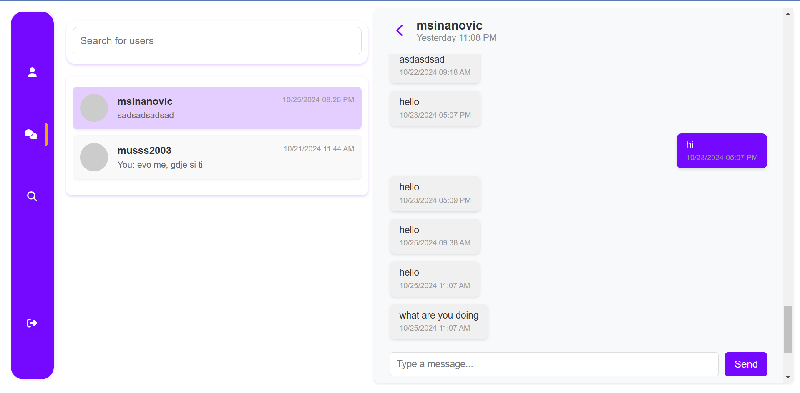

# Chat Application

A real-time chat application built using React, Express, MongoDB, and Socket.IO. This application enables users to communicate seamlessly with each other, providing a rich set of features to enhance the chatting experience.




## Table of Contents
- [About the Project](#about-the-project)
- [Features](#features)
- [Technologies Used](#technologies-used)
- [Getting Started](#getting-started)
- [Usage](#usage)
- [Contributing](#contributing)
- [License](#license)

## About the Project
This chat application allows users to create accounts, log in, and chat with other users in real-time. Built with modern technologies, it offers a clean and intuitive interface, making it easy to connect with friends or colleagues.

## Features
1. **User Authentication**
   - Users can create an account by providing their username and email.
   - Secure login functionality allows users to authenticate with their credentials.
   - Passwords are hashed and stored securely in the database.

   

   

2. **Real-Time Messaging**
   - Utilizes Socket.IO to enable real-time communication between users.
   - Messages sent by one user appear instantly on the recipient's screen.

3. **Online/Offline Status**
   - Displays online status for users, indicating whether they are currently active.
   - Users can see when their contacts are online or offline.

   

   

4. **Typing Indicators**
   - Shows when a user is typing a message, providing a more interactive chatting experience.
   - The typing status is visible to the intended recipient.

5. **Chat History**
   - Users can view their chat history with each contact.
   - Messages are fetched from the server and displayed in the chat interface.

   

6. **User Profiles**
   - Users can view profiles of other users, including their usernames and email addresses.
   - Additional profile information can be added, such as phone number, location, and bio.

7. **Search Functionality**
   - Users can search for other users to initiate a chat.
   - The search feature allows for quick access to contacts.

   

8. **Responsive Design**
   - The application is designed to be responsive and user-friendly on both desktop and mobile devices.
   - Adapts to various screen sizes for optimal usability.

## Technologies Used
- **React** - For building the user interface.
- **Express** - Backend framework for handling API requests.
- **MongoDB** - NoSQL database for storing user data and chat messages.
- **Socket.IO** - Library for real-time web socket communication.
- **Axios** - For making HTTP requests to the server.

## Getting Started

### Prerequisites
- Node.js: Ensure that Node.js is installed on your machine.

### Installation
1. Clone the repository:
    ```bash
    git clone https://github.com/musss2003/chat-app-client.git
    ```

2. Navigate to the project folder:
    ```bash
    cd chat-app
    ```

3. Install dependencies for both client and server:
    ```bash
    npm install
    ```

### Running the Application
1. Start the server:
    ```bash
    npm run server
    ```

2. Start the client:
    ```bash
    npm start
    ```

3. Access the application in your browser at `http://localhost:3000`.

## Usage
Once the app is running:
- Register or log in to your account.
- Use the search functionality to find other users and start a chat.
- Send messages to other users in real-time.
- Check the online status of your contacts and see when they are typing.

## Contributing
Contributions are welcome! To contribute:
1. Fork the project.
2. Create your feature branch:
    ```bash
    git checkout -b feature/YourFeature
    ```

3. Commit your changes:
    ```bash
    git commit -m 'Add some feature'
    ```

4. Push to the branch:
    ```bash
    git push origin feature/YourFeature
    ```

5. Open a pull request.

## License
Distributed under the MIT License. See [LICENSE](LICENSE) for more information.
